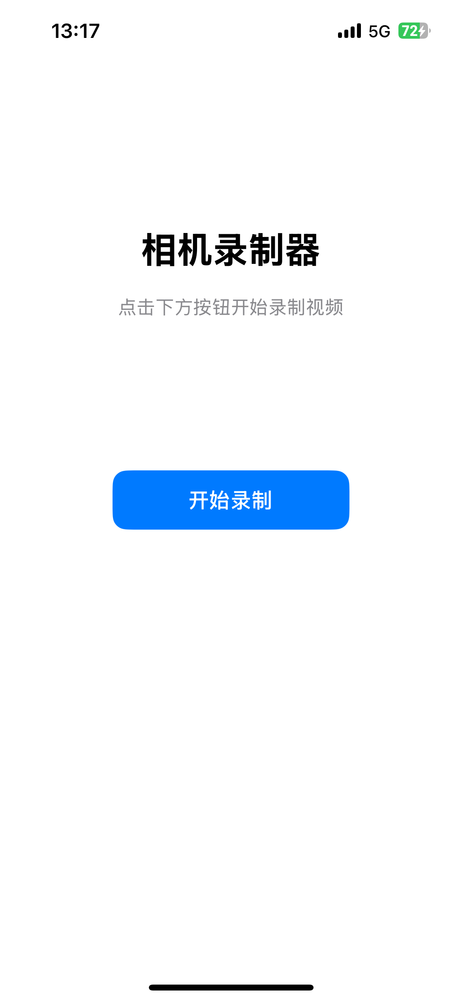
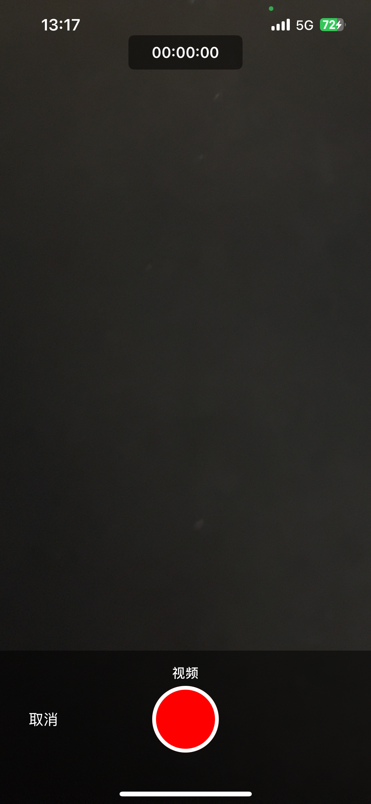
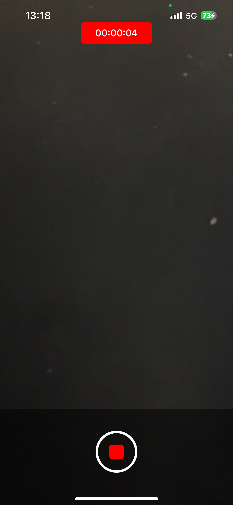
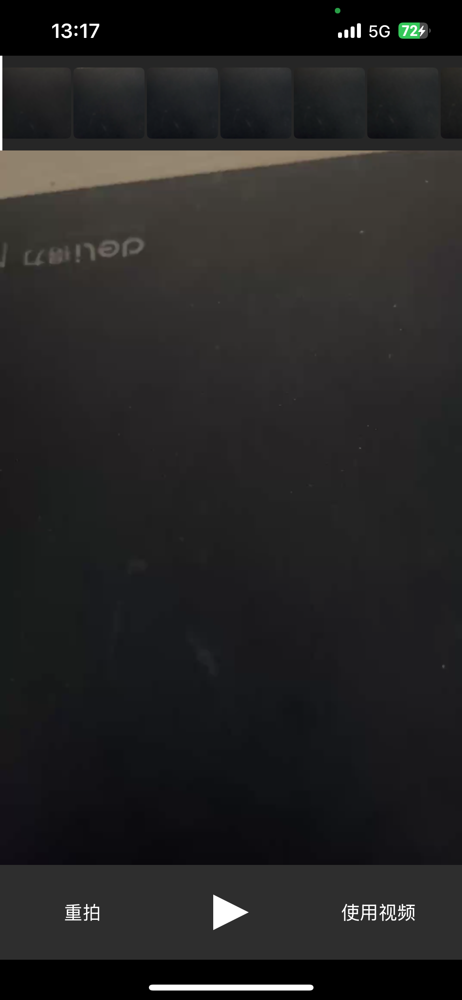
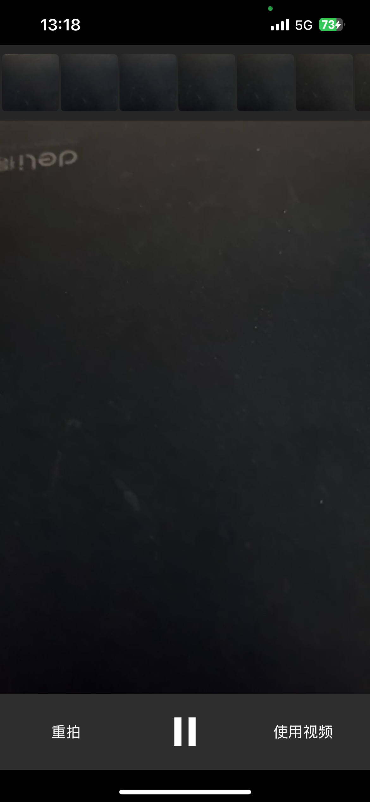

# CameraRecorderViewController

一个高仿 UIImagePickerController 的自定义相机录制组件，提供完整的视频录制、预览和播放功能。

## 简介

CameraRecorderViewController 是一个功能完整的 iOS 相机录制组件，基于 NextLevel 框架实现，提供了类似 UIImagePickerController 的使用体验。支持前后摄像头切换、实时预览、视频录制、预览播放等功能。

## 运行效果预览

### 主界面


### 相机录制界面


### 录制中


### 视频预览界面


### 全屏播放界面


## 功能特性

- ✅ 视频录制（支持前后摄像头）
- ✅ 实时相机预览
- ✅ 视频预览和播放
- ✅ 帧时间轴可视化
- ✅ 摄像头翻转
- ✅ 全屏播放模式
- ✅ 自定义 UI 界面

## 系统要求

- iOS 13.0 及以上
- Xcode 15.0 及以上
- Swift 5.0 及以上

## 快速开始

### 安装

1. 将 `CameraRecorderViewController` 文件夹添加到你的项目中
2. 确保所有源文件都已添加到 Target

### 基本使用

```swift
import UIKit

class ViewController: UIViewController {
    
    @IBAction func openCamera(_ sender: UIButton) {
        let cameraVC = CustomCameraRecorderViewController(cameraDeviceType: .rear)
        cameraVC.modalPresentationStyle = .fullScreen
        cameraVC.completion = { videoURL in
            // 处理录制完成的视频
            if let url = videoURL {
                print("视频保存路径: \(url)")
            }
        }
        present(cameraVC, animated: true)
    }
}
```

### 使用导航控制器

```swift
let cameraVC = CustomCameraRecorderViewController(cameraDeviceType: .rear)
let navController = UINavigationController(rootViewController: cameraVC)
navController.modalPresentationStyle = .fullScreen
present(navController, animated: true)
```

## API 说明

### CustomCameraRecorderViewController

#### 初始化

```swift
init(cameraDeviceType: CameraDeviceType)
```

- `cameraDeviceType`: 摄像头类型
  - `.front`: 前置摄像头
  - `.rear`: 后置摄像头

#### 属性

```swift
var completion: ((URL?) -> Void)?
```

录制完成回调，返回视频文件 URL。如果用户取消录制，返回 `nil`。

#### 使用示例

```swift
let cameraVC = CustomCameraRecorderViewController(cameraDeviceType: .rear)
cameraVC.completion = { videoURL in
    DispatchQueue.main.async {
        if let url = videoURL {
            // 使用录制的视频
            self.handleRecordedVideo(url: url)
        } else {
            // 用户取消了录制
            print("用户取消了录制")
        }
    }
}
present(cameraVC, animated: true)
```

## 项目结构

```
CameraRecorderViewController/
├── CustomCameraRecorderViewController.swift    # 主视图控制器
├── CustomCameraRecorderViewController.xib      # XIB 文件（可选）
├── SystemVolumeManager.swift                   # 系统音量管理
└── Sources/                                     # NextLevel 框架源码
    ├── NextLevel.h
    ├── NextLevel.swift
    └── ...
```

## 权限配置

在 `Info.plist` 中添加以下权限说明：

```xml
<key>NSCameraUsageDescription</key>
<string>需要访问相机以录制视频</string>

<key>NSMicrophoneUsageDescription</key>
<string>需要访问麦克风以录制音频</string>

<key>NSPhotoLibraryUsageDescription</key>
<string>需要访问照片库以保存视频</string>

<key>NSPhotoLibraryAddUsageDescription</key>
<string>需要访问照片库以保存视频</string>
```

## 依赖说明

### NextLevel

项目使用 NextLevel 框架进行相机捕获和视频录制。NextLevel 源码已包含在项目中，无需额外配置。

### 布局

项目使用原生 Auto Layout 进行界面布局，无需第三方依赖。

## 界面说明

### 录制界面


- **录制按钮**: 红色圆形按钮，点击开始/停止录制
- **取消按钮**: 左侧取消按钮，退出录制界面
- **翻转按钮**: 右侧翻转按钮，切换前后摄像头
- **时间显示**: 顶部显示录制时长

### 录制中界面


录制过程中会显示实时计时器，录制按钮变为红色方块表示正在录制。

### 预览界面


录制完成后进入预览界面：

- **帧时间轴**: 顶部显示视频帧缩略图
- **视频预览**: 中间区域播放录制的视频
- **重拍按钮**: 重新录制
- **播放/暂停**: 控制视频播放
- **使用视频**: 确认使用当前视频

### 全屏播放界面


点击"使用视频"后进入全屏播放模式：

- **返回按钮**: 左上角返回按钮，退出界面
- **视频播放**: 全屏播放录制的视频

## 注意事项

1. 首次使用需要用户授权相机和麦克风权限
2. 录制过程中请勿切换到其他应用，可能导致录制中断
3. 建议在真机上测试，模拟器可能无法正常使用相机功能
4. 视频文件会保存在临时目录，使用完成后请自行处理文件

## 常见问题

**Q: 录制没有声音？**  
A: 检查麦克风权限是否已授权，并确保设备音量未静音。

**Q: 预览界面无法播放视频？**  
A: 检查视频文件是否完整，可能是录制过程中被中断。

**Q: 如何自定义界面样式？**  
A: 修改 `CustomCameraRecorderViewController.swift` 中的 UI 相关代码。

## 更新日志

### v1.0.0
- 初始版本发布
- 支持视频录制和预览
- 支持前后摄像头切换
- 支持帧时间轴可视化

## 技术支持

如有任何问题或建议，欢迎联系：

- 📧 邮箱: 1045723701@qq.com
- 💬 QQ: 1045723701

也欢迎添加 QQ 好友进行技术交流。

## 项目合作

**有任何项目需求和合作欢迎联系：**

- ✅ 可以个性化定制
- ✅ 长期接单中

无论是功能定制、UI 设计调整，还是完整的项目开发，都可以根据您的需求进行个性化定制。欢迎通过邮箱或 QQ 联系洽谈合作事宜。

## 许可证

本项目中的 NextLevel 框架遵循 MIT 许可证。

## 致谢

感谢 NextLevel 框架提供的强大功能支持。
